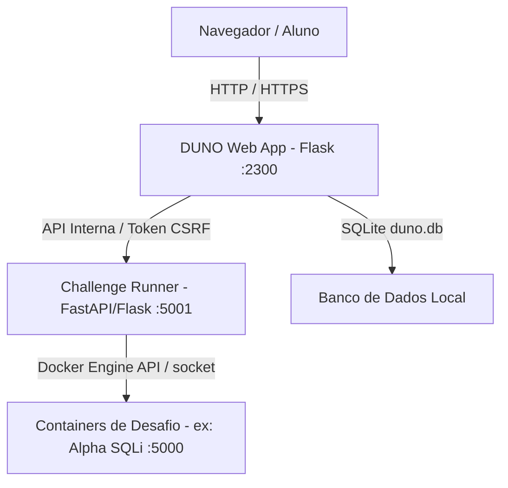

# DUNO CTF — Histórico Completo de Implementações e Melhorias (17/09/2026)

Este documento registra detalhadamente todas as decisões técnicas, arquitetura, alterações de código, rotas, interfaces e correções realizadas durante a sessão de melhorias do ecossistema de Desafios (CTF) da DUNO.

---

## 1. Visão Geral da Arquitetura

O sistema de desafios é composto por três camadas integradas:



1. **DUNO Core Web App (`app.py`, `modules/challenges/`)**:
   - Catálogo de desafios (`/desafios`), Detalhe (`/desafio/<id>`), Walkthrough guiado (`/desafio/<id>/walkthrough`).
   - Gerenciamento de sessão, autenticação, controle de instâncias por usuário e submissão de flags.
2. **Challenge Runner Service (`services/challenge_runner/`)**:
   - Microsserviço responsável pelo ciclo de vida dos containers Docker (start, stop, healthcheck, expiração automática).
3. **Frontend & Design System (`static/css/duno.css`, `templates/`)**:
   - UI baseada na identidade minimalista/hacker da DUNO, paleta harmonizada para Light e Soft Dark (`[data-theme="dark"]`), ícones do Nerd Font (`webfont.css`).

---

## 2. Linha do Tempo das Demandas e Melhorias

### Demanda 1: Ajuste de Cores no Dark Mode e Proporção do IP
- **Problema:** Ao iniciar uma máquina, as cores no modo escuro apresentavam contraste excessivo ou desajustado, o IP ficava esteticamente desproporcional e sem recurso ágil de cópia.
- **Solução Implementada:**
  - Criação da **Target Connection Bar** estilizada com fonte monoespecífica, fundo sutil e botões de ação compactos (Copiar IP + Abrir no navegador).
  - Cores ajustadas para verde esmeralda (`#10b981` no modo claro, `#34d399` com leve glow no modo escuro).
  - Normalização da string do endpoint: remoção de prefixos `http://` e `https://` para exibição direta de `IP:PORTA`.

### Demanda 2: Redução da Altura do Card e Ocultação de Tags Spoilers
- **Problema:** O card de desafios na listagem (`templates/components/challenge_card.html`) estava muito alto e as tags expunham antecipadamente as técnicas/vulnerabilidades do desafio.
- **Solução Implementada:**
  - Remoção completa do bloco de tags do card de catálogo.
  - Otimização do grid de especificações (`POINTS`, `XP`, `MACHINE/OS`, `DIFFICULTY`, `FLAGS + ROOT`).
  - Redução de paddings e alinhamento compacto do rodapé (`View Walkthrough` + kicker `EXPLORE / ROOT`).

### Demanda 3: IP "Não iniciado", Contador de 1 Hora e Renovação no Walkthrough
- **Problema:** Ao abrir `/desafio/1/walkthrough`, aparecia `IP: Não iniciado` de forma estática e não havia controle visual do tempo de sessão da instância.
- **Solução Implementada:**
  - Criação do **Card de Sessão Ativa (`.wt-session-card`)**:
    - Relógio de contagem regressiva em tempo real (`wt-countdown-digits`).
    - Barra de progresso visual de expiração (`.wt-session-meter`).
    - Botão dinâmico **"Renovar +60 min"** (`#btn-renew-time`) integrado via AJAX à rota de extensão de lease com feedback visual.
  - Sincronização do estado da máquina com a rota `/api/challenges/<id>/instances` e `/api/challenge-instances/<id>/stop`.

### Demanda 4: Ajuste de Largura e Exibição Completa do IP
- **Problema:** O texto do IP ficava parcialmente cortado ou comprimido em resoluções menores.
- **Solução Implementada:**
  - Ajuste na regra `.wt-target-ip-txt` e `.running-ip-txt`: remoção de cortes de largura (`min-width: 0; flex: 1; text-overflow: ellipsis; white-space: nowrap; font-size: 0.82rem;`).
  - Garantia de que portas de 4 e 5 dígitos apareçam integralmente em conjunto com o botão de cópia.

### Demanda 5: Remoção do Badge de IP no Cabeçalho e Eliminação do Efeito Piscante
- **Problema:**
  - O cabeçalho central do Walkthrough apresentava um chip de IP redundante (`INJEÇÃO SQL [TARGET: 10.10.15.11:5000]`).
  - O ponto de status da barra de alvo ficava piscando continuamente (`animation: pulse-dot 1.5s infinite`), incomodando a leitura.
- **Solução Implementada:**
  - Remoção do badge do cabeçalho central em `templates/pages/walkthrough.html`.
  - Remoção definitiva da animação `@keyframes pulse-dot` em `static/css/duno.css`.
  - Substituição do ponto circular pelo ícone estático do Nerd Font **`nf-md-target`** (`<i class="nf nf-md-target ..."></i>`), tanto no card do desafio quanto na barra lateral do walkthrough.

---

## 3. Mapeamento dos Arquivos Modificados

| Arquivo | Finalidade Principal |
|---|---|
| `templates/pages/walkthrough.html` | Layout completo do walkthrough: barra de alvo, card de sessão com timer regressivo, botão de renovar, remoção do badge do cabeçalho e uso do `nf-md-target`. |
| `templates/components/challenge_card.html` | Card do catálogo CTF: altura compactada, tags removidas, barra de alvo com IP/cópia e ícone `nf-md-target`. |
| `templates/base.html` | Alternador global de temas (Light/Dark), inclusão do CSS do Nerd Font e bump de cachebuster `v=20260917_5`. |
| `static/css/duno.css` | Regras do design system: `.wt-session-card`, `.wt-target-bar`, `.wt-target-icon`, `.running-target-icon`, remoção de `@keyframes pulse-dot`. |
| `modules/challenges/routes.py` | Rotas de API e renderização dos desafios, instâncias Docker e renovação de tempo. |
| `modules/challenges/catalog.py` | Estrutura de metadados dos desafios (Alpha SQLi, flags, dificuldade, SO). |
| `services/challenge_runner/app.py` | Microsserviço de orquestração Docker para provisionar e destruir containers de desafio. |
| `tests/test_challenge_routes.py` | Bateria de testes automatizados garantindo estabilidade e cobertura do catálogo e instâncias. |

---

## 4. Snippets Críticos de Implementação

### 4.1. Barra de Alvo no Walkthrough (`walkthrough.html`)
```html
<!-- ═══ TARGET CONNECTION BAR (Elegante & Funcional) ═══ -->

<div class="wt-target-bar is-running" id="wt-target-bar">
  <div class="wt-target-bar-left">
    <i class="nf nf-md-target wt-target-icon active" id="wt-target-icon" aria-hidden="true" title="Alvo ativo"></i>
    <span class="wt-target-ip-txt" id="wt-machine-ip">{{ clean_endpoint if clean_endpoint else 'Não iniciado' }}</span>
  </div>
  <div class="wt-target-bar-actions" id="wt-target-actions" style="display: none;">
    <button type="button" 
            class="wt-target-btn js-copy-wt-ip" 
            id="wt-copy-ip-btn"
            data-ip="{{ clean_endpoint }}" 
            title="Copiar IP do alvo">
      <i class="nf nf-md-content_copy" aria-hidden="true"></i>
    </button>
    <a href="{{ challenge.endpoint or '#' }}" 
       target="_blank" 
       rel="noopener" 
       class="wt-target-btn wt-target-link" 
       id="wt-open-ip-btn"
       title="Abrir alvo em nova aba">
      <i class="nf nf-md-open_in_new" aria-hidden="true"></i>
    </a>
  </div>
</div>
```

### 4.2. Card de Sessão e Timer Regressivo (`walkthrough.html`)
```html
<div class="wt-session-card" id="wt-session-card" style="display: none;">
  <div class="wt-session-header">
    <div class="wt-session-title-wrap">
      <i class="nf nf-md-timer_sand" aria-hidden="true"></i>
      <span>Tempo de Sessão</span>
    </div>
    <div class="wt-countdown-digits" id="wt-countdown-digits">60:00</div>
  </div>
  <div class="wt-session-meter">
    <div class="wt-session-meter-fill" id="wt-session-meter-fill" style="width: 100%;"></div>
  </div>
  <div class="wt-session-footer">
    <button type="button" class="wt-btn-renew" id="btn-renew-time" data-instance-id="{{ challenge.instance_id or '' }}">
      <i class="nf nf-md-update" aria-hidden="true"></i> Renovar +60 min
    </button>
    <span class="wt-renew-feedback" id="wt-renew-feedback"></span>
  </div>
</div>
```

### 4.3. Estilos CSS do Alvo e Remoção de Animação Piscante (`duno.css`)
```css
.running-target-icon {
  font-size: 0.95rem;
  line-height: 1;
  display: inline-flex;
  align-items: center;
  justify-content: center;
  color: #10b981;
  flex-shrink: 0;
}

.wt-target-icon {
  font-size: 0.95rem;
  line-height: 1;
  display: inline-flex;
  align-items: center;
  justify-content: center;
  color: var(--ink-3, #9ca3af);
  flex-shrink: 0;
  transition: color 0.15s ease, text-shadow 0.15s ease;
}

.wt-target-icon.active {
  color: #10b981;
}

[data-theme="dark"] .running-target-icon,
[data-theme="dark"] .wt-target-icon.active {
  color: #34d399;
  text-shadow: 0 0 8px rgba(52, 211, 153, 0.35);
}
```

---

## 5. Procedimentos de Validação e Testes

Para garantir que o ambiente permaneça 100% íntegro após qualquer reinicialização ou manutenção:

1. **Testes Unitários e de Integração:**
   ```bash
   pytest tests/ -q
   ```
   *Resultado esperado:* 47 testes aprovados (`47 passed`).

2. **Checagem de Tipagem Estática (Pyright):**
   ```bash
   npx -y pyright services/challenge_runner/app.py tests/test_challenge_routes.py
   ```
   *Resultado esperado:* 0 erros, 0 avisos.

3. **Validação do Servidor Web:**
   Acessar `http://192.168.100.10:2300/desafio/1/walkthrough` e verificar:
   - Ausência de badge de IP no cabeçalho superior.
   - Ícone `nf-md-target` estático (sem piscar).
   - Ao iniciar a máquina: IP exibido com formatação correta e botão de cópia funcional.
   - Timer de 60 minutos ativo com possibilidade de renovação.

---

## 6. Desafio Bravo (Weak JWT) — Flags Híbridas e Walkthrough Completo

### 6.1. Especificação do Formato de Flag Híbrido
O formato das flags da máquina Bravo foi padronizado no modelo da plataforma: `DUNO{<hash_md5_32_chars>}`:
- **FLAG 1 (Auth Bypass via JWT `alg: none` e Painel Admin):**
  `DUNO{5d41402abc4b2a76b9719d911017c592}`
- **FLAG 2 (SSTI no Jinja2 para RCE e leitura de `/app/flag2.txt`):**
  `DUNO{7c6a180b36896a0a8c02787eeafb0e4c}`
- **FLAG 3 (Root Privilege Escalation via GTFOBins `env`/`python3` em `/root/flag3.txt`):**
  `DUNO{9e107d9d372bb6826bd81d3542a419d6}`

### 6.2. Arquitetura Modular do Walkthrough
A estrutura de `templates/pages/walkthrough.html` foi refatorada para suportar múltiplos desafios mantendo a mesma barra lateral, timer regressivo de 1h, botão de renovação e barra de alvo com `nf-md-target`:
- `templates/pages/walkthroughs/alpha_content.html` & `alpha_aside.html`: Guia de SQL Injection.
- `templates/pages/walkthroughs/bravo_content.html` & `bravo_aside.html`: Guia completo de JWT Bypass, SSTI no Jinja2, GTFOBins no Linux e script automatizado `solve_bravo.py`.
- Inclusão condicional limpa no template principal sem duplicação de scripts ou layout.

